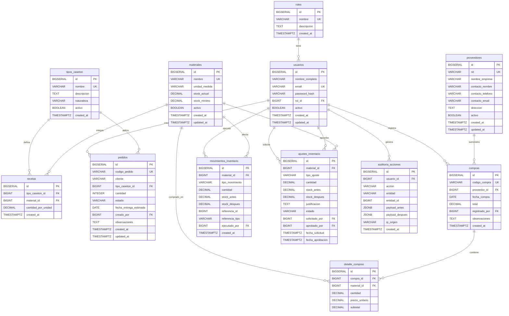

# Modelo de Datos — CASETECH ERP

> **Versión:** 1.0.0  
> **Fecha:** Agosto 2026  
> **Equipo:** Andrés Fernández · Oscar Ruiz · Javier Sepúlveda · Angélica Arregoces  
> **Clasificación:** Documento Técnico — Arquitectura de Base de Datos  
> **Motor:** PostgreSQL 16 (imagen Docker `postgres:16-alpine`)  
> **Patrón:** ERP Web Modular BOM (Bill of Materials) · Esquema genérico y parametrizable

---

## Tabla de Contenidos

1. [Diagrama Entidad-Relación Conceptual](#1-diagrama-entidad-relación-conceptual)
2. [Diccionario de Datos](#2-diccionario-de-datos)
3. [Reglas de Integridad Referencial](#3-reglas-de-integridad-referencial)
4. [Índices](#4-índices)
5. [Stored Procedures PL/pgSQL](#5-stored-procedures-plpgsql)
6. [Enumeraciones y Dominios](#6-enumeraciones-y-dominios)
7. [Estrategia de Migración con Alembic](#7-estrategia-de-migración-con-alembic)

---

## 1. Diagrama Entidad-Relación Conceptual



---

## 2. Diccionario de Datos

> **Convenciones:**
> - `PK` — Clave Primaria | `FK` — Clave Foránea | `UK` — Restricción de Unicidad
> - `NOT NULL` se asume en todas las columnas salvo que se indique `NULL`
> - `TIMESTAMPTZ` equivale a `TIMESTAMP WITH TIME ZONE`
> - El campo `activo BOOLEAN` implementa **borrado lógico** en entidades de negocio principales

---

### 2.1 `roles`

Catálogo estático de roles del sistema. Poblada por migraciones Alembic; sin CRUD desde la API.

| Columna | Tipo PostgreSQL | Restricciones | Descripción |
|---------|----------------|---------------|-------------|
| `id` | `BIGSERIAL` | `PK` | Identificador autoincremental del rol |
| `nombre` | `VARCHAR(50)` | `NOT NULL, UNIQUE` | Nombre canónico: `ADMINISTRADOR`, `OPERARIO` |
| `descripcion` | `TEXT` | `NULL` | Descripción de las capacidades del rol |
| `created_at` | `TIMESTAMPTZ` | `NOT NULL, DEFAULT NOW()` | Fecha y hora de creación |

**Datos semilla:**
```sql
INSERT INTO roles (nombre, descripcion) VALUES
  ('ADMINISTRADOR', 'Acceso completo: CRUD usuarios, proveedores, pedidos, inventario, auditoría.'),
  ('OPERARIO',      'Acceso de consulta operativa: pedidos e inventario. Sin modificación de datos.');
```

---

### 2.2 `usuarios`

Usuarios autenticados mediante JWT. Contraseñas almacenadas como hash bcrypt (12 rounds); nunca en texto plano.

| Columna | Tipo PostgreSQL | Restricciones | Descripción |
|---------|----------------|---------------|-------------|
| `id` | `BIGSERIAL` | `PK` | Identificador autoincremental |
| `nombre_completo` | `VARCHAR(255)` | `NOT NULL` | Nombre completo del usuario |
| `email` | `VARCHAR(255)` | `NOT NULL, UNIQUE` | Dirección de correo electrónico (login) |
| `password_hash` | `VARCHAR(255)` | `NOT NULL` | Hash bcrypt de la contraseña (rounds=12) |
| `rol_id` | `BIGINT` | `NOT NULL, FK → roles(id) ON DELETE RESTRICT` | Rol asignado al usuario |
| `activo` | `BOOLEAN` | `NOT NULL, DEFAULT TRUE` | Borrado lógico: `FALSE` bloquea el acceso sin eliminar historial |
| `created_at` | `TIMESTAMPTZ` | `NOT NULL, DEFAULT NOW()` | Fecha y hora de creación |
| `updated_at` | `TIMESTAMPTZ` | `NULL` | Fecha y hora de última modificación |

**Restricción adicional:**
```sql
CHECK (email ~* '^[A-Za-z0-9._%+-]+@[A-Za-z0-9.-]+\.[A-Za-z]{2,}$')
```

---

### 2.3 `proveedores`

Directorio de proveedores con borrado lógico. El NIT es el identificador único de negocio e **inmutable** después de la creación.

| Columna | Tipo PostgreSQL | Restricciones | Descripción |
|---------|----------------|---------------|-------------|
| `id` | `BIGSERIAL` | `PK` | Identificador autoincremental |
| `nit` | `VARCHAR(20)` | `NOT NULL, UNIQUE` | NIT o RUT del proveedor (gestionado por `sp_crear_proveedor`) |
| `nombre_empresa` | `VARCHAR(255)` | `NOT NULL` | Razón social del proveedor |
| `contacto_nombre` | `VARCHAR(255)` | `NULL` | Nombre de la persona de contacto |
| `contacto_telefono` | `VARCHAR(20)` | `NULL` | Teléfono de contacto |
| `contacto_email` | `VARCHAR(255)` | `NULL` | Correo electrónico de contacto |
| `direccion` | `TEXT` | `NULL` | Dirección física o de correspondencia |
| `activo` | `BOOLEAN` | `NOT NULL, DEFAULT TRUE` | Borrado lógico; no se elimina si tiene compras asociadas |
| `created_at` | `TIMESTAMPTZ` | `NOT NULL, DEFAULT NOW()` | Fecha y hora de creación |
| `updated_at` | `TIMESTAMPTZ` | `NULL` | Fecha y hora de última modificación |

---

### 2.4 `materiales`

Inventario maestro de materias primas. `stock_actual` es la **fuente de verdad**; solo se modifica mediante Stored Procedures.

| Columna | Tipo PostgreSQL | Restricciones | Descripción |
|---------|----------------|---------------|-------------|
| `id` | `BIGSERIAL` | `PK` | Identificador autoincremental |
| `nombre` | `VARCHAR(255)` | `NOT NULL, UNIQUE` | Nombre descriptivo (ej. "Madera — Listones", "Bloques EPS") |
| `unidad_medida` | `VARCHAR(30)` | `NOT NULL` | Unidad: `m`, `m²`, `m³`, `kg`, `und`, `culmo` |
| `stock_actual` | `DECIMAL(12,3)` | `NOT NULL, DEFAULT 0, CHECK (stock_actual >= 0)` | Cantidad disponible. **Nunca puede ser negativo.** |
| `stock_minimo` | `DECIMAL(12,3)` | `NOT NULL, DEFAULT 0, CHECK (stock_minimo >= 0)` | Umbral mínimo para activar alerta de reposición |
| `activo` | `BOOLEAN` | `NOT NULL, DEFAULT TRUE` | Borrado lógico |
| `created_at` | `TIMESTAMPTZ` | `NOT NULL, DEFAULT NOW()` | Fecha y hora de creación |
| `updated_at` | `TIMESTAMPTZ` | `NULL` | Fecha y hora de última modificación |

> [!IMPORTANT]
> El constraint `CHECK (stock_actual >= 0)` es la última línea de defensa en la BD. Los Stored Procedures también validan antes de descontar para proveer mensajes de error comprensibles.

---

### 2.5 `tipos_caseton`

Catálogo de tipos de producto (núcleo BOM genérico). `naturaleza` determina el comportamiento del descuento de inventario.

| Columna | Tipo PostgreSQL | Restricciones | Descripción |
|---------|----------------|---------------|-------------|
| `id` | `BIGSERIAL` | `PK` | Identificador autoincremental |
| `nombre` | `VARCHAR(255)` | `NOT NULL, UNIQUE` | Nombre del tipo (ej. "Casetón de Lona 60x60") |
| `descripcion` | `TEXT` | `NULL` | Descripción técnica del producto |
| `naturaleza` | `VARCHAR(20)` | `NOT NULL, CHECK (naturaleza IN ('RECUPERABLE', 'PERDIDO'))` | `RECUPERABLE`: módulo reutilizable (Lona, Guadua) · `PERDIDO`: material embebido en obra (Icopor/EPS) |
| `activo` | `BOOLEAN` | `NOT NULL, DEFAULT TRUE` | Borrado lógico; no se puede desactivar con pedidos activos |
| `created_at` | `TIMESTAMPTZ` | `NOT NULL, DEFAULT NOW()` | Fecha y hora de creación |

**Datos semilla:**
```sql
INSERT INTO tipos_caseton (nombre, descripcion, naturaleza) VALUES
  ('Casetón de Lona 60x60',   'Bastidor de madera con lona tensada. Módulo reutilizable.',               'RECUPERABLE'),
  ('Casetón de Guadua 60x60', 'Cercha estructural en guadua y madera con amarres. Módulo reutilizable.', 'RECUPERABLE'),
  ('Casetón de Icopor 60x60', 'Bloque EPS. Queda fundido permanentemente en la losa.',                   'PERDIDO');
```

---

### 2.6 `recetas`

Lista de materiales (BOM) por tipo de producto. Define la cantidad exacta de cada materia prima por **unidad producida**.

| Columna | Tipo PostgreSQL | Restricciones | Descripción |
|---------|----------------|---------------|-------------|
| `id` | `BIGSERIAL` | `PK` | Identificador autoincremental |
| `tipo_caseton_id` | `BIGINT` | `NOT NULL, FK → tipos_caseton(id) ON DELETE RESTRICT` | Tipo de casetón al que pertenece esta línea |
| `material_id` | `BIGINT` | `NOT NULL, FK → materiales(id) ON DELETE RESTRICT` | Material requerido |
| `cantidad_por_unidad` | `DECIMAL(10,4)` | `NOT NULL, CHECK (cantidad_por_unidad > 0)` | Cantidad por unidad producida (ej. 2.5 m de madera por módulo) |
| `created_at` | `TIMESTAMPTZ` | `NOT NULL, DEFAULT NOW()` | Fecha de creación de la línea |

**Restricción de unicidad compuesta:**
```sql
CONSTRAINT uq_receta_tipo_material UNIQUE (tipo_caseton_id, material_id)
```

El total de material para un pedido de N unidades = `cantidad_por_unidad × N`.

---

### 2.7 `pedidos`

Órdenes de producción con ciclo de vida: `PENDIENTE → EN_PRODUCCION → COMPLETADO` o `CANCELADO`.

| Columna | Tipo PostgreSQL | Restricciones | Descripción |
|---------|----------------|---------------|-------------|
| `id` | `BIGSERIAL` | `PK` | Identificador autoincremental |
| `codigo_pedido` | `VARCHAR(20)` | `NOT NULL, UNIQUE` | Código legible generado por el sistema (ej. `PED-2026-00042`) |
| `cliente` | `VARCHAR(255)` | `NOT NULL` | Nombre del cliente o empresa solicitante |
| `tipo_caseton_id` | `BIGINT` | `NOT NULL, FK → tipos_caseton(id) ON DELETE RESTRICT` | Tipo de casetón solicitado |
| `cantidad` | `INTEGER` | `NOT NULL, CHECK (cantidad > 0)` | Número de unidades solicitadas |
| `estado` | `VARCHAR(20)` | `NOT NULL, DEFAULT 'PENDIENTE', CHECK (estado IN ('PENDIENTE','EN_PRODUCCION','COMPLETADO','CANCELADO'))` | Estado actual en el flujo productivo |
| `fecha_entrega_estimada` | `DATE` | `NOT NULL` | Fecha compromiso de entrega |
| `creado_por` | `BIGINT` | `NOT NULL, FK → usuarios(id) ON DELETE RESTRICT` | Usuario ADMINISTRADOR que registró el pedido |
| `observaciones` | `TEXT` | `NULL` | Notas adicionales |
| `created_at` | `TIMESTAMPTZ` | `NOT NULL, DEFAULT NOW()` | Fecha y hora de creación |
| `updated_at` | `TIMESTAMPTZ` | `NULL` | Fecha y hora de la última actualización de estado |

**Transiciones de estado permitidas:**
```
PENDIENTE ──────────────────► EN_PRODUCCION ──► COMPLETADO
    │                                │
    └────────────────────────────────┴──────────► CANCELADO
```

`COMPLETADO` y `CANCELADO` son **estados terminales** — ningún endpoint puede modificar un pedido que los alcanzó.

---

### 2.8 `compras`

Cabecera de órdenes de compra a proveedores.

| Columna | Tipo PostgreSQL | Restricciones | Descripción |
|---------|----------------|---------------|-------------|
| `id` | `BIGSERIAL` | `PK` | Identificador autoincremental |
| `codigo_compra` | `VARCHAR(20)` | `NOT NULL, UNIQUE` | Código legible (ej. `CMP-2026-00015`) |
| `proveedor_id` | `BIGINT` | `NOT NULL, FK → proveedores(id) ON DELETE RESTRICT` | Proveedor que suministró los materiales |
| `fecha_compra` | `DATE` | `NOT NULL` | Fecha efectiva de la compra o recepción |
| `total` | `DECIMAL(14,2)` | `NOT NULL, DEFAULT 0, CHECK (total >= 0)` | Total en pesos colombianos (COP) |
| `registrado_por` | `BIGINT` | `NOT NULL, FK → usuarios(id) ON DELETE RESTRICT` | Usuario que registró la compra |
| `observaciones` | `TEXT` | `NULL` | Número de factura, condiciones, notas |
| `created_at` | `TIMESTAMPTZ` | `NOT NULL, DEFAULT NOW()` | Fecha y hora de creación |

---

### 2.9 `detalle_compras`

Líneas de la orden de compra. Cada fila representa un material adquirido.

| Columna | Tipo PostgreSQL | Restricciones | Descripción |
|---------|----------------|---------------|-------------|
| `id` | `BIGSERIAL` | `PK` | Identificador autoincremental |
| `compra_id` | `BIGINT` | `NOT NULL, FK → compras(id) ON DELETE CASCADE` | Compra a la que pertenece esta línea |
| `material_id` | `BIGINT` | `NOT NULL, FK → materiales(id) ON DELETE RESTRICT` | Material comprado |
| `cantidad` | `DECIMAL(12,3)` | `NOT NULL, CHECK (cantidad > 0)` | Cantidad recibida en la unidad del material |
| `precio_unitario` | `DECIMAL(12,2)` | `NOT NULL, CHECK (precio_unitario >= 0)` | Precio por unidad en COP |
| `subtotal` | `DECIMAL(14,2)` | `NOT NULL, GENERATED ALWAYS AS (cantidad * precio_unitario) STORED` | Subtotal calculado automáticamente por PostgreSQL |

---

### 2.10 `movimientos_inventario`

Log **inmutable** de todos los movimientos de inventario. Nunca se elimina ni modifica un registro de esta tabla.

| Columna | Tipo PostgreSQL | Restricciones | Descripción |
|---------|----------------|---------------|-------------|
| `id` | `BIGSERIAL` | `PK` | Identificador autoincremental |
| `material_id` | `BIGINT` | `NOT NULL, FK → materiales(id) ON DELETE RESTRICT` | Material afectado |
| `tipo_movimiento` | `VARCHAR(40)` | `NOT NULL, CHECK (tipo_movimiento IN ('INGRESO_COMPRA','DESCUENTO_PRODUCCION','DESCUENTO_PRODUCCION_DEFINITIVO','DEVOLUCION_CANCELACION','AJUSTE_APROBADO'))` | Naturaleza del movimiento |
| `cantidad` | `DECIMAL(12,3)` | `NOT NULL` | Magnitud del movimiento (siempre positiva; el tipo indica la dirección) |
| `stock_antes` | `DECIMAL(12,3)` | `NOT NULL` | Stock **antes** del movimiento (snapshot de trazabilidad) |
| `stock_despues` | `DECIMAL(12,3)` | `NOT NULL` | Stock **después** del movimiento |
| `referencia_id` | `BIGINT` | `NULL` | ID del documento origen (pedido, compra o ajuste) |
| `referencia_tipo` | `VARCHAR(20)` | `NULL, CHECK (referencia_tipo IN ('PEDIDO','COMPRA','AJUSTE'))` | Tipo del documento origen |
| `ejecutado_por` | `BIGINT` | `NULL, FK → usuarios(id) ON DELETE SET NULL` | Usuario que desencadenó el movimiento |
| `created_at` | `TIMESTAMPTZ` | `NOT NULL, DEFAULT NOW()` | Timestamp inmutable del movimiento |

**Tipos de movimiento y reversibilidad:**

| `tipo_movimiento` | Efecto | Origen | Reversible |
|-------------------|--------|--------|:----------:|
| `INGRESO_COMPRA` | ➕ Suma | Registro de compra | ✅ |
| `DESCUENTO_PRODUCCION` | ➖ Resta | Pedido `RECUPERABLE` a `EN_PRODUCCION` | ✅ |
| `DESCUENTO_PRODUCCION_DEFINITIVO` | ➖ Resta | Pedido `PERDIDO` (EPS) a `EN_PRODUCCION` | 🚫 |
| `DEVOLUCION_CANCELACION` | ➕ Suma | Cancelación de pedido `RECUPERABLE` | ✅ |
| `AJUSTE_APROBADO` | ➕/➖ | Ajuste de inventario aprobado | ✅ Auditable |

---

### 2.11 `ajustes_inventario`

Solicitudes de ajuste manual (mermas, sobrantes, conteos físicos). Requieren **doble firma**: quién solicita y quién aprueba.

| Columna | Tipo PostgreSQL | Restricciones | Descripción |
|---------|----------------|---------------|-------------|
| `id` | `BIGSERIAL` | `PK` | Identificador autoincremental |
| `material_id` | `BIGINT` | `NOT NULL, FK → materiales(id) ON DELETE RESTRICT` | Material que se ajusta |
| `tipo_ajuste` | `VARCHAR(20)` | `NOT NULL, CHECK (tipo_ajuste IN ('MERMA','DEVOLUCION_PROVEEDOR','CONTEO_FISICO','SOBRANTE'))` | Clasificación del ajuste |
| `cantidad` | `DECIMAL(12,3)` | `NOT NULL` | Magnitud del ajuste. Negativo para descuentos, positivo para ingresos |
| `stock_antes` | `DECIMAL(12,3)` | `NOT NULL` | Stock al momento de solicitar (snapshot) |
| `stock_despues` | `DECIMAL(12,3)` | `NULL` | Stock resultante tras aprobación (calculado al aprobar) |
| `justificacion` | `TEXT` | `NOT NULL, CHECK (LENGTH(justificacion) >= 20)` | Descripción obligatoria ≥ 20 caracteres de la causa del ajuste |
| `estado` | `VARCHAR(25)` | `NOT NULL, DEFAULT 'PENDIENTE_APROBACION', CHECK (estado IN ('PENDIENTE_APROBACION','APROBADO','RECHAZADO'))` | Estado en el flujo de aprobación |
| `solicitado_por` | `BIGINT` | `NOT NULL, FK → usuarios(id) ON DELETE RESTRICT` | Usuario que solicita el ajuste |
| `aprobado_por` | `BIGINT` | `NULL, FK → usuarios(id) ON DELETE RESTRICT` | ADMINISTRADOR que aprueba o rechaza |
| `fecha_solicitud` | `TIMESTAMPTZ` | `NOT NULL, DEFAULT NOW()` | Timestamp de la solicitud |
| `fecha_aprobacion` | `TIMESTAMPTZ` | `NULL` | Timestamp de la aprobación o rechazo |

---

### 2.12 `auditoria_acciones`

Log de auditoría de acciones significativas. Tabla **append-only**; ningún registro se modifica ni elimina.

| Columna | Tipo PostgreSQL | Restricciones | Descripción |
|---------|----------------|---------------|-------------|
| `id` | `BIGSERIAL` | `PK` | Identificador autoincremental |
| `usuario_id` | `BIGINT` | `NULL, FK → usuarios(id) ON DELETE SET NULL` | Usuario que realizó la acción |
| `accion` | `VARCHAR(50)` | `NOT NULL` | Verbo: `CREAR_USUARIO`, `CAMBIO_ESTADO_PEDIDO`, `APROBAR_AJUSTE`, etc. |
| `entidad` | `VARCHAR(50)` | `NOT NULL` | Tabla afectada: `pedidos`, `materiales`, `usuarios`, etc. |
| `entidad_id` | `BIGINT` | `NULL` | ID del registro afectado |
| `payload_antes` | `JSONB` | `NULL` | Snapshot JSON del estado **antes** de la acción |
| `payload_despues` | `JSONB` | `NULL` | Snapshot JSON del estado **después** de la acción |
| `ip_origen` | `VARCHAR(45)` | `NULL` | Dirección IP del cliente (soporta IPv6) |
| `created_at` | `TIMESTAMPTZ` | `NOT NULL, DEFAULT NOW()` | Timestamp inmutable de la acción |

---

## 3. Reglas de Integridad Referencial

| Relación FK | Política | Justificación |
|-------------|----------|---------------|
| `usuarios.rol_id → roles.id` | `ON DELETE RESTRICT` | No eliminar un rol con usuarios asignados |
| `pedidos.creado_por → usuarios.id` | `ON DELETE RESTRICT` | Trazabilidad de quién creó cada pedido |
| `pedidos.tipo_caseton_id → tipos_caseton.id` | `ON DELETE RESTRICT` | Histórico de producción intacto |
| `compras.proveedor_id → proveedores.id` | `ON DELETE RESTRICT` | Usar borrado lógico; preservar historial |
| `compras.registrado_por → usuarios.id` | `ON DELETE RESTRICT` | Trazabilidad de compras |
| `detalle_compras.compra_id → compras.id` | `ON DELETE CASCADE` | Los detalles son inseparables de su cabecera |
| `detalle_compras.material_id → materiales.id` | `ON DELETE RESTRICT` | Historial de precios por material |
| `recetas.tipo_caseton_id → tipos_caseton.id` | `ON DELETE RESTRICT` | El BOM define el tipo de producto |
| `recetas.material_id → materiales.id` | `ON DELETE RESTRICT` | Un material en receta no puede eliminarse |
| `movimientos_inventario.material_id → materiales.id` | `ON DELETE RESTRICT` | Log de auditoría irrompible |
| `movimientos_inventario.ejecutado_por → usuarios.id` | `ON DELETE SET NULL` | El log persiste aunque el usuario se elimine |
| `ajustes_inventario.material_id → materiales.id` | `ON DELETE RESTRICT` | Integridad del flujo de aprobación |
| `ajustes_inventario.solicitado_por → usuarios.id` | `ON DELETE RESTRICT` | Trazabilidad del solicitante |
| `ajustes_inventario.aprobado_por → usuarios.id` | `ON DELETE RESTRICT` | Trazabilidad del aprobador |
| `auditoria_acciones.usuario_id → usuarios.id` | `ON DELETE SET NULL` | La auditoría no puede perder registros |

---

## 4. Índices

```sql
-- Autenticación: búsqueda por email
CREATE UNIQUE INDEX idx_usuarios_email
    ON usuarios (email);

-- Proveedores: búsqueda por NIT
CREATE UNIQUE INDEX idx_proveedores_nit
    ON proveedores (nit);

-- Pedidos: filtros operativos frecuentes
CREATE INDEX idx_pedidos_estado
    ON pedidos (estado);
CREATE INDEX idx_pedidos_cliente
    ON pedidos (cliente);
CREATE INDEX idx_pedidos_tipo_fecha
    ON pedidos (tipo_caseton_id, created_at DESC);

-- Dashboard KPI: materiales en alerta de stock mínimo
CREATE INDEX idx_materiales_stock_alerta
    ON materiales (stock_actual)
    WHERE activo = TRUE;

-- Movimientos: auditoría por material y fecha
CREATE INDEX idx_movimientos_material_fecha
    ON movimientos_inventario (material_id, created_at DESC);
CREATE INDEX idx_movimientos_referencia
    ON movimientos_inventario (referencia_tipo, referencia_id);

-- Ajustes: pendientes de aprobación (partial index — muy selectivo)
CREATE INDEX idx_ajustes_pendientes
    ON ajustes_inventario (estado)
    WHERE estado = 'PENDIENTE_APROBACION';

-- Auditoría: filtro por usuario y rango de fechas
CREATE INDEX idx_auditoria_usuario_fecha
    ON auditoria_acciones (usuario_id, created_at DESC);
CREATE INDEX idx_auditoria_entidad
    ON auditoria_acciones (entidad, entidad_id);

-- BOM lookup: recetas por tipo de casetón
CREATE INDEX idx_recetas_tipo_caseton
    ON recetas (tipo_caseton_id);
```

---

## 5. Stored Procedures PL/pgSQL

> [!IMPORTANT]
> Todos los Stored Procedures operan dentro de una **transacción atómica** PL/pgSQL. Ante cualquier error, el bloque `EXCEPTION` re-lanza la excepción hacia FastAPI, que hace `rollback` automático a través de SQLAlchemy y retorna `HTTP 422 Unprocessable Entity` con el mensaje descriptivo.

---

### 5.1 `sp_crear_proveedor`

**Propósito:** Inserción segura de un proveedor con validación explícita de unicidad del NIT, normalización de datos y registro en auditoría. Retorna el `id` generado mediante parámetro `OUT`.

```sql
CREATE OR REPLACE PROCEDURE sp_crear_proveedor(
    p_nit               VARCHAR(20),
    p_nombre_empresa    VARCHAR(255),
    p_contacto_nombre   VARCHAR(255),
    p_contacto_telefono VARCHAR(20),
    p_contacto_email    VARCHAR(255),
    p_direccion         TEXT,
    p_usuario_id        BIGINT,
    OUT p_proveedor_id  BIGINT
)
LANGUAGE plpgsql
AS $$
DECLARE
    v_existe BOOLEAN;
BEGIN
    -- 1. Validar unicidad del NIT (case-insensitive)
    SELECT EXISTS (
        SELECT 1 FROM proveedores WHERE UPPER(nit) = UPPER(TRIM(p_nit))
    ) INTO v_existe;

    IF v_existe THEN
        RAISE EXCEPTION
            'Ya existe un proveedor registrado con el NIT "%". El NIT es un identificador único e inmutable.',
            UPPER(TRIM(p_nit))
        USING ERRCODE = '23505';  -- unique_violation
    END IF;

    -- 2. Insertar normalizando datos
    INSERT INTO proveedores (
        nit,
        nombre_empresa,
        contacto_nombre,
        contacto_telefono,
        contacto_email,
        direccion
    )
    VALUES (
        UPPER(TRIM(p_nit)),
        TRIM(p_nombre_empresa),
        TRIM(p_contacto_nombre),
        TRIM(p_contacto_telefono),
        LOWER(TRIM(p_contacto_email)),
        p_direccion
    )
    RETURNING id INTO p_proveedor_id;

    -- 3. Registrar en auditoría
    INSERT INTO auditoria_acciones (
        usuario_id, accion, entidad, entidad_id, payload_despues
    )
    VALUES (
        p_usuario_id,
        'CREAR_PROVEEDOR',
        'proveedores',
        p_proveedor_id,
        jsonb_build_object(
            'nit',           UPPER(TRIM(p_nit)),
            'nombre_empresa', TRIM(p_nombre_empresa)
        )
    );

EXCEPTION
    WHEN OTHERS THEN
        RAISE;  -- Re-lanza para que SQLAlchemy haga rollback
END;
$$;
```

**Invocación desde FastAPI:**
```python
from sqlalchemy import text

result = db.execute(
    text("""
        CALL sp_crear_proveedor(
            :nit, :nombre, :contacto_nombre, :telefono,
            :email, :direccion, :uid, NULL
        )
    """),
    {
        "nit":            proveedor_data.nit,
        "nombre":         proveedor_data.nombre_empresa,
        "contacto_nombre": proveedor_data.contacto_nombre,
        "telefono":       proveedor_data.contacto_telefono,
        "email":          proveedor_data.contacto_email,
        "direccion":      proveedor_data.direccion,
        "uid":            current_user.id,
    }
)
db.commit()
```

---

### 5.2 `sp_descontar_receta`

**Propósito:** Descuento atómico de todas las materias primas de la receta BOM al confirmar el inicio de producción. Opera con **bloqueo pesimista** (`SELECT FOR UPDATE`) para serializar el acceso concurrente y evitar condiciones de carrera. Diferencia el tipo de movimiento según la naturaleza del casetón.

**Lógica diferenciada:**
- `RECUPERABLE` (Lona, Guadua) → `DESCUENTO_PRODUCCION` (reversible)
- `PERDIDO` (Icopor/EPS) → `DESCUENTO_PRODUCCION_DEFINITIVO` (irreversible)

```sql
CREATE OR REPLACE PROCEDURE sp_descontar_receta(
    p_pedido_id  BIGINT,
    p_usuario_id BIGINT
)
LANGUAGE plpgsql
AS $$
DECLARE
    v_tipo_caseton_id BIGINT;
    v_naturaleza      VARCHAR(20);
    v_cantidad_pedido INTEGER;
    v_estado_actual   VARCHAR(20);
    v_tipo_mov        VARCHAR(40);
    v_rec             RECORD;
    v_stock_actual    DECIMAL(12,3);
    v_consumo_total   DECIMAL(12,3);
BEGIN
    -- ─────────────────────────────────────────────────
    -- 1. Obtener y bloquear el pedido (evita doble confirmación)
    -- ─────────────────────────────────────────────────
    SELECT estado, tipo_caseton_id, cantidad
    INTO   v_estado_actual, v_tipo_caseton_id, v_cantidad_pedido
    FROM   pedidos
    WHERE  id = p_pedido_id
    FOR UPDATE;

    IF NOT FOUND THEN
        RAISE EXCEPTION 'Pedido con ID % no encontrado.', p_pedido_id
        USING ERRCODE = 'P0002';
    END IF;

    IF v_estado_actual <> 'PENDIENTE' THEN
        RAISE EXCEPTION
            'El pedido % no puede iniciar producción desde el estado "%". Solo pedidos PENDIENTE pueden iniciarse.',
            p_pedido_id, v_estado_actual
        USING ERRCODE = 'P0001';
    END IF;

    -- ─────────────────────────────────────────────────
    -- 2. Determinar naturaleza y tipo de movimiento
    -- ─────────────────────────────────────────────────
    SELECT naturaleza INTO v_naturaleza
    FROM   tipos_caseton
    WHERE  id = v_tipo_caseton_id;

    IF v_naturaleza = 'PERDIDO' THEN
        v_tipo_mov := 'DESCUENTO_PRODUCCION_DEFINITIVO';
    ELSE
        v_tipo_mov := 'DESCUENTO_PRODUCCION';
    END IF;

    -- ─────────────────────────────────────────────────
    -- 3. Iterar sobre la receta BOM con bloqueo por material
    --    ORDER BY material_id garantiza orden consistente
    --    entre sesiones concurrentes (previene deadlocks)
    -- ─────────────────────────────────────────────────
    FOR v_rec IN
        SELECT
            r.material_id,
            m.nombre                                  AS nombre_material,
            m.unidad_medida,
            r.cantidad_por_unidad * v_cantidad_pedido AS consumo_total
        FROM  recetas r
        JOIN  materiales m ON m.id = r.material_id
        WHERE r.tipo_caseton_id = v_tipo_caseton_id
        ORDER BY r.material_id
    LOOP
        v_consumo_total := v_rec.consumo_total;

        -- Bloqueo pesimista del registro de inventario
        SELECT stock_actual INTO v_stock_actual
        FROM   materiales
        WHERE  id = v_rec.material_id
        FOR UPDATE;

        -- Validar suficiencia antes de descontar
        IF v_stock_actual < v_consumo_total THEN
            RAISE EXCEPTION
                'Stock insuficiente para "%". Disponible: % %s — Requerido: % %s — Déficit: % %s.',
                v_rec.nombre_material,
                v_stock_actual,  v_rec.unidad_medida,
                v_consumo_total, v_rec.unidad_medida,
                (v_consumo_total - v_stock_actual), v_rec.unidad_medida
            USING ERRCODE = 'P0001';
        END IF;

        -- Aplicar el descuento
        UPDATE materiales
        SET    stock_actual = stock_actual - v_consumo_total,
               updated_at   = NOW()
        WHERE  id = v_rec.material_id;

        -- Registrar movimiento con snapshot de stock
        INSERT INTO movimientos_inventario (
            material_id,        tipo_movimiento,  cantidad,
            stock_antes,        stock_despues,
            referencia_id,      referencia_tipo,  ejecutado_por
        )
        VALUES (
            v_rec.material_id,  v_tipo_mov,       v_consumo_total,
            v_stock_actual,     v_stock_actual - v_consumo_total,
            p_pedido_id,        'PEDIDO',          p_usuario_id
        );
    END LOOP;

    -- ─────────────────────────────────────────────────
    -- 4. Cambiar estado del pedido a EN_PRODUCCION
    -- ─────────────────────────────────────────────────
    UPDATE pedidos
    SET    estado     = 'EN_PRODUCCION',
           updated_at = NOW()
    WHERE  id = p_pedido_id;

    -- 5. Registrar en auditoría
    INSERT INTO auditoria_acciones (
        usuario_id, accion, entidad, entidad_id, payload_despues
    )
    VALUES (
        p_usuario_id,
        'CAMBIO_ESTADO_PEDIDO',
        'pedidos',
        p_pedido_id,
        jsonb_build_object(
            'estado_anterior',    'PENDIENTE',
            'estado_nuevo',       'EN_PRODUCCION',
            'naturaleza_caseton', v_naturaleza,
            'tipo_movimiento',    v_tipo_mov
        )
    );

EXCEPTION
    WHEN OTHERS THEN
        RAISE;
END;
$$;
```

**Invocación desde FastAPI:**
```python
from sqlalchemy import text
from sqlalchemy.exc import InternalError
from fastapi import HTTPException

try:
    db.execute(
        text("CALL sp_descontar_receta(:pedido_id, :usuario_id)"),
        {"pedido_id": pedido_id, "usuario_id": current_user.id}
    )
    db.commit()
except InternalError as e:
    db.rollback()
    raise HTTPException(status_code=422, detail=str(e.orig))
```

---

### 5.3 `sp_ajuste_inventario`

**Propósito:** Aprobación (o rechazo) de un ajuste manual de inventario por un ADMINISTRADOR. Aplica el cambio de stock, valida que no quede negativo, registra el movimiento y actualiza la auditoría. Implementa doble firma: el aprobador no puede ser el mismo que el solicitante.

```sql
CREATE OR REPLACE PROCEDURE sp_ajuste_inventario(
    p_ajuste_id BIGINT,
    p_aprobador BIGINT,
    p_aprobar   BOOLEAN   -- TRUE: aprobar y aplicar | FALSE: rechazar sin modificar stock
)
LANGUAGE plpgsql
AS $$
DECLARE
    v_ajuste       RECORD;
    v_stock_actual DECIMAL(12,3);
    v_stock_nuevo  DECIMAL(12,3);
BEGIN
    -- ─────────────────────────────────────────────────
    -- 1. Obtener y bloquear el ajuste
    -- ─────────────────────────────────────────────────
    SELECT * INTO v_ajuste
    FROM   ajustes_inventario
    WHERE  id = p_ajuste_id
    FOR UPDATE;

    IF NOT FOUND THEN
        RAISE EXCEPTION 'Ajuste con ID % no encontrado.', p_ajuste_id
        USING ERRCODE = 'P0002';
    END IF;

    IF v_ajuste.estado <> 'PENDIENTE_APROBACION' THEN
        RAISE EXCEPTION
            'El ajuste % ya fue procesado (estado: %). No puede modificarse.',
            p_ajuste_id, v_ajuste.estado
        USING ERRCODE = 'P0001';
    END IF;

    -- Doble firma: el aprobador no puede ser el solicitante
    IF v_ajuste.solicitado_por = p_aprobador THEN
        RAISE EXCEPTION
            'El usuario (ID: %) no puede aprobar un ajuste que él mismo solicitó.',
            p_aprobador
        USING ERRCODE = 'P0001';
    END IF;

    -- ─────────────────────────────────────────────────
    -- 2. RECHAZO: solo actualizar estado, sin tocar stock
    -- ─────────────────────────────────────────────────
    IF NOT p_aprobar THEN
        UPDATE ajustes_inventario
        SET    estado           = 'RECHAZADO',
               aprobado_por     = p_aprobador,
               fecha_aprobacion = NOW()
        WHERE  id = p_ajuste_id;

        INSERT INTO auditoria_acciones (usuario_id, accion, entidad, entidad_id)
        VALUES (p_aprobador, 'RECHAZAR_AJUSTE', 'ajustes_inventario', p_ajuste_id);

        RETURN;  -- Salir sin modificar inventario
    END IF;

    -- ─────────────────────────────────────────────────
    -- 3. APROBACIÓN: bloquear material y aplicar cambio
    -- ─────────────────────────────────────────────────
    SELECT stock_actual INTO v_stock_actual
    FROM   materiales
    WHERE  id = v_ajuste.material_id
    FOR UPDATE;

    -- cantidad es negativa para MERMA/DEVOLUCION, positiva para SOBRANTE
    v_stock_nuevo := v_stock_actual + v_ajuste.cantidad;

    IF v_stock_nuevo < 0 THEN
        RAISE EXCEPTION
            'El ajuste de % unidades dejaría el stock del material ID % en % (negativo). Operación rechazada.',
            v_ajuste.cantidad, v_ajuste.material_id, v_stock_nuevo
        USING ERRCODE = 'P0001';
    END IF;

    -- Aplicar el cambio de stock
    UPDATE materiales
    SET    stock_actual = v_stock_nuevo,
           updated_at   = NOW()
    WHERE  id = v_ajuste.material_id;

    -- Actualizar el ajuste con resultado
    UPDATE ajustes_inventario
    SET    estado           = 'APROBADO',
           aprobado_por     = p_aprobador,
           stock_despues    = v_stock_nuevo,
           fecha_aprobacion = NOW()
    WHERE  id = p_ajuste_id;

    -- Registrar el movimiento de inventario
    INSERT INTO movimientos_inventario (
        material_id,           tipo_movimiento,  cantidad,
        stock_antes,           stock_despues,
        referencia_id,         referencia_tipo,  ejecutado_por
    )
    VALUES (
        v_ajuste.material_id,  'AJUSTE_APROBADO', v_ajuste.cantidad,
        v_stock_actual,        v_stock_nuevo,
        p_ajuste_id,           'AJUSTE',          p_aprobador
    );

    -- Registrar en auditoría con snapshots antes/después
    INSERT INTO auditoria_acciones (
        usuario_id,  accion,          entidad,
        entidad_id,  payload_antes,   payload_despues
    )
    VALUES (
        p_aprobador,
        'APROBAR_AJUSTE',
        'ajustes_inventario',
        p_ajuste_id,
        jsonb_build_object(
            'stock_antes',  v_stock_actual,
            'tipo_ajuste',  v_ajuste.tipo_ajuste
        ),
        jsonb_build_object(
            'stock_despues',      v_stock_nuevo,
            'cantidad_ajustada',  v_ajuste.cantidad
        )
    );

EXCEPTION
    WHEN OTHERS THEN
        RAISE;
END;
$$;
```

**Invocación desde FastAPI:**
```python
# Aprobar ajuste
db.execute(
    text("CALL sp_ajuste_inventario(:ajuste_id, :aprobador_id, TRUE)"),
    {"ajuste_id": ajuste_id, "aprobador_id": current_user.id}
)
db.commit()

# Rechazar ajuste
db.execute(
    text("CALL sp_ajuste_inventario(:ajuste_id, :aprobador_id, FALSE)"),
    {"ajuste_id": ajuste_id, "aprobador_id": current_user.id}
)
db.commit()
```

---

## 6. Enumeraciones y Dominios

En lugar de tipos `ENUM` de PostgreSQL (costosos de migrar), CASETECH usa `VARCHAR` con restricciones `CHECK`. Agregar un nuevo valor requiere solo un `ALTER TABLE ... DROP CONSTRAINT ... ADD CONSTRAINT` en una migración Alembic.

| Campo | Tabla | Valores válidos |
|-------|-------|----------------|
| `roles.nombre` | `roles` | `ADMINISTRADOR`, `OPERARIO` |
| `tipos_caseton.naturaleza` | `tipos_caseton` | `RECUPERABLE`, `PERDIDO` |
| `pedidos.estado` | `pedidos` | `PENDIENTE`, `EN_PRODUCCION`, `COMPLETADO`, `CANCELADO` |
| `ajustes_inventario.tipo_ajuste` | `ajustes_inventario` | `MERMA`, `DEVOLUCION_PROVEEDOR`, `CONTEO_FISICO`, `SOBRANTE` |
| `ajustes_inventario.estado` | `ajustes_inventario` | `PENDIENTE_APROBACION`, `APROBADO`, `RECHAZADO` |
| `movimientos_inventario.tipo_movimiento` | `movimientos_inventario` | `INGRESO_COMPRA`, `DESCUENTO_PRODUCCION`, `DESCUENTO_PRODUCCION_DEFINITIVO`, `DEVOLUCION_CANCELACION`, `AJUSTE_APROBADO` |
| `movimientos_inventario.referencia_tipo` | `movimientos_inventario` | `PEDIDO`, `COMPRA`, `AJUSTE` |

---

## 7. Estrategia de Migración con Alembic

Las migraciones se ejecutan en orden de dependencias de claves foráneas:

```
001 — create_table_roles
002 — create_table_usuarios
003 — create_table_proveedores
004 — create_table_materiales
005 — create_table_tipos_caseton
006 — create_table_recetas
007 — create_table_pedidos
008 — create_table_compras
009 — create_table_detalle_compras
010 — create_table_movimientos_inventario
011 — create_table_ajustes_inventario
012 — create_table_auditoria_acciones
013 — create_indexes
014 — create_sp_crear_proveedor
015 — create_sp_descontar_receta
016 — create_sp_ajuste_inventario
017 — seed_roles_y_tipos_caseton
```

**Comandos en el contenedor Docker:**
```bash
# Aplicar todas las migraciones (ejecutado automáticamente en el entrypoint)
alembic upgrade head

# Crear una nueva migración
alembic revision --autogenerate -m "agregar_campo_codigo_interno_a_materiales"

# Revertir la última migración
alembic downgrade -1

# Ver historial de migraciones aplicadas
alembic history --verbose
```

**Entrypoint del contenedor backend** (`backend/entrypoint.sh`):
```bash
#!/bin/sh
set -e
echo "Aplicando migraciones Alembic..."
alembic upgrade head
echo "Iniciando servidor Uvicorn..."
exec uvicorn app.main:app --host 0.0.0.0 --port 8000
```

---

> **Documento revisado y aprobado por:** Andrés Fernández (Tech Lead)  
> **Próxima revisión:** Inicio del Sprint 1 — validación del esquema con datos reales de producción  
> **Documentos relacionados:** [`01-analisis-y-alcance.md`](./01-analisis-y-alcance.md) · [`02-requisitos-sistema.md`](./02-requisitos-sistema.md) · [`03-historias-de-usuario.md`](./03-historias-de-usuario.md)
